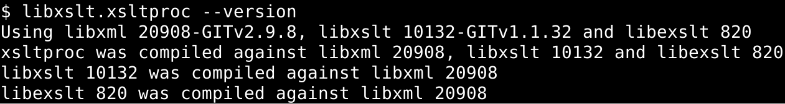

# Unofficial Snap Packaging for The XSLT C library for GNOME
<!--
​	Use the Staticaly service for easy access to in-repo pictures:
​	https://www.staticaly.com/
-->

**This is the unofficial snap for The XSLT C library for GNOME**, *"An XSLT C library developed for the GNOME project"*. It works on Ubuntu, Fedora, Debian, and other major Linux distributions.

Published for  with 💝 by Snapcrafters

## Installation
([Don't have snapd installed?](https://snapcraft.io/docs/core/install))

### In a Terminal
    # Install the snap #
    sudo snap install --channel=beta libxslt
    #sudo snap install libxslt
    
    # Connect the snap to optional security confinement interfaces #
    ## For accessing files under `/media`, `/run/media` or `/mnt` ##
    sudo snap connect libxslt:removable-media
    
    # Launch the application #
    libxslt.xsltproc

    ## If you want to use the `xsltproc` alias
    snap alias libxslt.xsltproc xsltproc
    xsltproc

### The Graphical Way

## What is Working
* [The examples on the XSLT Wikipedia article](../test-cases/xslt-wikipedia-article/README.md)

## What is NOT Working...yet 
Check out the [issue tracker](https://github.com/Lin-Buo-Ren/libxslt-snap/issues) for known issues.

## Support
* Report issues regarding using this snap to the issue tracker:  
  <https://github.com/Lin-Buo-Ren/libxslt-snap/issues>
* You may also post on the Snapcraft Forum, under the `snap` topic category:  
  <https://forum.snapcraft.io/c/snap>

